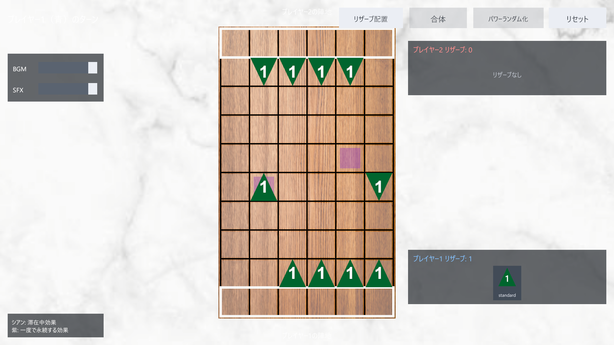

# GCCC2026 Group A Board Game

Unity 6で開発している、2人対戦の陣地到達型ボードゲームです。6列×10行の盤面で青と赤の駒を交互に動かし、戦闘を行いながら相手の陣地への到達を目指します。



## 現在のゲーム

プレイヤー1（青・先手）とプレイヤー2（赤）が、6個ずつの駒を交互に1マス動かします。移動できる方向は移動プロファイルと現在の戦闘力から決まり、標準設定では戦闘力2〜7でそれぞれ右上、右下、左上、左下、左、右の1方向が使用できなくなります。敵駒のマスへ移動すると互いの戦闘力を同時にダメージとして与え合い、戦闘力が0以下になった駒は消滅します。

生存した自分の駒が相手の陣地へ到達すれば勝利です。相手駒を全滅させるだけでは勝利になりません。

ルールの詳細は[ゲームルール](docs/GAME_RULES.md)を参照してください。

## 実装状況

| 機能 | 状態 | 備考 |
|---|---|---|
| 6×10盤面・陣地 | 実装済み | 設定アセットから生成 |
| 2人の交互手番 | 実装済み | 自動パス・引き分けを含む |
| 戦闘力別の1マス移動 | 実装済み | 移動プロファイルの方向フラグに対応 |
| 同時相互ダメージ戦闘 | 実装済み | 戦闘力の更新・消滅を含む |
| 陣地到達勝利 | 実装済み | リセットまで入力を停止 |
| マウス・タッチ入力 | 実装済み | UI上の入力は盤面へ伝播しない |
| 合体 | 拡張口のみ | `FusePiecesCommand`は現在`FusionDisabled`を返す |
| 特殊マス | 拡張口のみ | 現行設定に効果とHandlerは未登録 |
| CPU | 拡張口のみ | `IPlayerAgent`を実装して追加する |
| CI | 未導入 | Unity Test Runnerをローカル実行する |

## 必要環境

- Unity `6000.3.11f1`
- Windows、macOS、またはLinux上のUnity Editor
- Git
- 推奨IDE: Visual StudioまたはJetBrains Rider

主なUnity PackageはURP `17.3.0`、Input System `1.19.0`、uGUI `2.0.0`、Test Framework `1.6.0`です。プロジェクトにはUnity MCPもPackageとして登録されていますが、ゲームの実行には必須ではありません。

## クイックスタート

1. リポジトリを取得し、Unity Hubでプロジェクトルートを開きます。
2. Unity `6000.3.11f1`で`Assets/Scenes/SampleScene.unity`を開きます。
3. Game Viewを16:9にして再生します。
4. 自分の駒をクリックし、緑またはオレンジで示された移動先をクリックします。
5. 初期状態へ戻す場合は右上の「リセット」を押します。

テストの実行方法は[テストガイド](docs/TESTING.md)を参照してください。

## ドキュメント

| やりたいこと | 読む文書 |
|---|---|
| ルールを知る | [ゲームルール](docs/GAME_RULES.md) |
| 環境を作って動かす | [開発ガイド](docs/DEVELOPMENT.md) |
| 全体設計を把握する | [アーキテクチャ](docs/ARCHITECTURE.md) |
| Coreの型を使って書く | [Core APIリファレンス](docs/CORE_API.md) |
| 機能を追加する | [拡張ガイド](docs/EXTENSION_GUIDE.md) |
| テストする | [テストガイド](docs/TESTING.md) |

どの情報がどの文書に属するかは[開発ガイド §11](docs/DEVELOPMENT.md#11-文書の担当範囲)にまとめています。

## コード構成

```text
Assets/
├─ Config/BoardGame/              盤面・初期配置の設定アセット
├─ Prefabs/BoardGame/             盤面、駒、HUDのPrefab
├─ Scenes/SampleScene.unity       実行用Scene
├─ Scripts/BoardGame/
│  ├─ Core/                       Unity非依存の状態・ルール
│  └─ Presentation/               Unityの入力・表示・組み立て
└─ Tests/
   ├─ EditMode/                   Coreのルールテスト
   └─ PlayMode/                   表示・操作・Scene統合テスト
```

`GCCC.BoardGame.Core`は`noEngineReferences: true`でUnity APIへ依存しません。Unity上の入力と表示は`GCCC.BoardGame.Presentation`に閉じ込め、将来のCPUもCoreへコマンドを送る構成です。

## 開発時の基本原則

- ゲーム状態を変更するのは`GameSession`だけにします。
- Presentationは`GameSnapshot`と`CommandResult.Events`を見て表示し、ルールを再実装しません。
- 機能単位のブランチと小さなPRを使用し、人単位の恒久ブランチは作りません。
- Sceneを直接編集する変更を減らし、設定・Prefab・コードを担当別に分けます。
- Unityの`.meta`ファイルは対応するAssetと一緒にコミットします。
