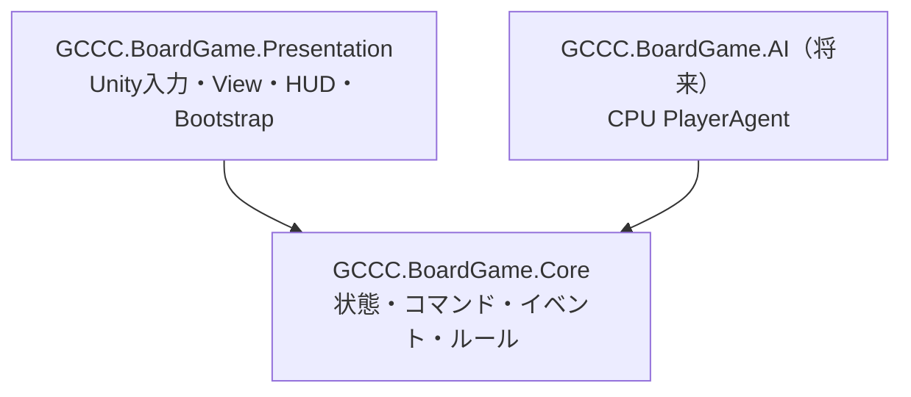
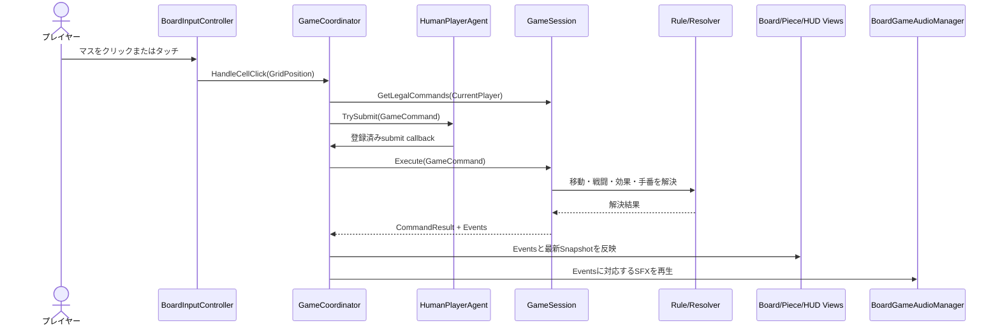

# アーキテクチャ

この文書は**設計判断**を扱います。型ごとのコンストラクタ引数やコード例は[Core APIリファレンス](CORE_API.md)を、機能の追加手順は[拡張ガイド](EXTENSION_GUIDE.md)を参照してください。

## 1. 設計方針

本プロジェクトは、ゲームルールをUnityから分離し、複数人が担当領域ごとに作業できる構成を採用しています。



`GCCC.BoardGame.Core.asmdef`は`noEngineReferences: true`で、`UnityEngine`、`MonoBehaviour`、`Vector2Int`、Input System、uGUIへ依存しません。Unity固有の処理はPresentationに置きます。

## 2. レイヤーの責務

| レイヤー | 主な責務 | 禁止事項 |
|---|---|---|
| Core Model | 盤面、セル、駒、プレイヤー、Snapshot | Unity型への依存 |
| Core Commands | プレイヤーからの操作要求 | Viewの直接操作 |
| Core Events | コマンド実行によって起きた事実 | Unity演出の指定 |
| Core Rules | 移動、戦闘、合体、特殊効果、手番 | InputやUIの参照 |
| `GameSession` | 公開APIを保つFacade、検証、コマンド実行、イベント生成 | Unityオブジェクトの保持 |
| Presentation Input | マウス・タッチを盤面座標へ変換 | ルール判定の再実装 |
| `GameCoordinator` | 選択状態、Agent、Command、Viewの仲介 | Core状態の直接変更 |
| Presentation Views | SnapshotとEventに従った表示 | 勝敗やダメージの独自計算 |
| Presentation Audio | Eventに対応するBGM・SFX再生と音量管理 | 戦闘・合体結果の独自判定 |
| Bootstrap | Config、Core、Prefab、Cameraの組み立て | ゲームルールの実装 |

## 3. Coreの状態モデル

### 型の役割

| 型 | 役割 |
|---|---|
| `GridPosition` | `Column`と`Row`を持つUnity非依存の座標値 |
| `PieceId` | 駒を一意に識別する値オブジェクト |
| `PlayerId` | `Player1`または`Player2` |
| `MoveDirections` | 8方向を表すフラグ列挙型 |
| `MovementProfileId` | 駒が使用する戦闘力別移動プロファイルのID |
| `PowerMovementBand` | 戦闘力の最小値・最大値と、その範囲で許可する方向 |
| `PowerMovementProfile` | 戦闘力1以上を隙間なく覆う移動帯域の集合 |
| `PieceState` | ID、所有者、位置、通常／一時戦闘力、移動プロファイルID、効果状態を持つ不変オブジェクト |
| `CellDefinition` | 位置、陣地所有者、特殊効果IDの順序付き一覧 |
| `CellEffectDefinition` | 効果IDと`WhileOccupied`／`PermanentOncePerPiece`の固定定義 |
| `InitialPieceDefinition` | リセット時に生成する駒の定義 |
| `GameDefinition` | 盤面サイズ、全セル、初期駒、先手、移動プロファイル、効果定義、駒上限、リザーブ配置範囲 |
| `PlayerState` | プレイヤーごとのリザーブ駒を持つ不変の実行時状態 |
| `GameSnapshot` | 駒、セル、効果定義、Player状態、手番、勝敗、駒上限、リザーブ配置範囲を公開する読み取り専用コピー |

`GridPosition`にUnityの`Vector2Int`を使わないのは、Coreをエンジン非依存に保つためです。同じ理由で、座標が盤内かどうかの判定も`GridPosition`ではなく`GameSnapshot`やRuleが持ちます。

### 不変性

`PieceState`の変更は`WithPosition`、`WithCombatPower`、`WithMovementProfile`、`WithAttributes`で新しいインスタンスを作成します。移動方向は状態として重複保持せず、`MovementProfileId`と現在の戦闘力から`ProfileMoveDirectionResolver`が算出します。`GameSnapshot`の公開コンストラクタは駒とセルをコピーするため、ViewやCPUが過去のSnapshotや進行中の状態を書き換えることはできません。`WithLegalCommands`は既に不変化された盤面データを共有し、合法Command一覧だけを差し替えます。

戦闘力が0以下になった駒は、戦闘力0の`PieceState`として残すのではなく`GameSession`の管理対象から削除されます。「盤上に存在する駒は必ず戦闘力1以上」という不変条件を型のレベルで保証するためです。

### `GameSession`

`GameSession`は実行時状態へアクセスできる唯一の公開Facadeです。内部では`GameStateStore`が駒とリザーブ、`LegalCommandGenerator`が合法手生成、`CellEffectProcessor`がセル効果、`ReserveDeploymentRules`が配置範囲を担当します。状態更新時にはSnapshotと合法Commandキャッシュが同時に無効化されます。外部コードはこれらのinternal型やDictionaryへアクセスできません。

```csharp
GameSnapshot Snapshot { get; }
CommandResult Execute(GameCommand command);
IReadOnlyList<GameCommand> GetLegalCommands(PlayerId player);
void Reset();
```

`GameSnapshot`は不変の読み取りモデルです。通常は`GameSession.Snapshot`から取得し、合法Commandを付与するときは`WithLegalCommands`を使用します。公開コンストラクタはテストや独立したView描画に利用できますが、生成したSnapshotから`GameSession`内部状態を変更することはできません。

## 4. CommandとResult

### Command

Commandは「状態をこの値に変える」というデータではなく、プレイヤーが`GameSession`へ送る操作要求です。

- `MovePieceCommand`: 指定した自分の駒を目的地へ動かす要求。
- `FusePiecesCommand`: 指定した隣接自駒2個の合体を試みる要求。
- `RandomizePowerCommand`: 指定した自駒の通常戦闘力を1〜3へ変更する要求。
- `DeployReservePieceCommand`: リザーブ駒を自陣側の合法な空きマスへ配置する要求。

すべてのCommandは`Player`を持ち、`GameSession.Execute`で次の順に検証されます。

1. Commandがnullではない。
2. ゲームが終了していない。
3. Commandのプレイヤーが現在手番と一致する。
4. Command型がFacadeの型switchに対応している。
5. 対象駒の存在、所有権、個別ルールが正しい。

### `CommandResult`

成功時は`Success=true`と発生した`GameEvent`の一覧を返します。失敗時は状態を変更せず、次の`CommandFailureReason`を返します。

| 失敗理由 | 意味 |
|---|---|
| `GameOver` | 勝敗または引き分けが確定済み |
| `NotPlayersTurn` | Commandのプレイヤーが手番ではない |
| `PieceNotFound` | 指定したIDの駒が存在しない |
| `NotPieceOwner` | 指定した駒が自分のものではない |
| `IllegalMove` | ルール上許可されない移動または合体 |
| `FusionDisabled` | 合体機能が無効 |
| `ReservePieceNotFound` | 指定したリザーブ駒が存在しない |
| `PieceLimitReached` | プレイヤーの盤上駒が上限に達している |
| `InvalidDeploymentPosition` | リザーブ配置範囲外、盤外、または使用中のマス |
| `InvalidCommand` | Commandがnull、または対応Handlerがない |

失敗時に状態を変更しないことは、CPUやテストがCommandを安全に試せる前提になります。

## 5. Event

Eventは「何をしてほしいか」ではなく、Command実行によって「何が起きたか」を表します。

| Event | 意味 |
|---|---|
| `PieceMoved` | 駒が移動元から移動先へ進んだ |
| `CombatResolved` | 攻撃・防御の戦闘力計算が完了した |
| `PiecePowerChanged` | 生存駒の戦闘力が変わった |
| `PieceDestroyed` | 駒が盤面から消滅した |
| `PiecesFused` | 2個の駒が新しい駒へ合体した |
| `FusionAttemptFailed` | 合法な合体を試みたが確率判定に失敗した |
| `RandomizePowerEvent` | パワーランダム化による変更前後の値が確定した |
| `CellEffectTriggered` | セル効果が順序どおりに発動した |
| `CellEffectExpired` | 退出により滞在中効果が終了した |
| `ReservePieceAdded` | プレイヤーのリザーブへ駒が追加された |
| `ReservePieceDeployed` | リザーブ駒が盤上へ配置された |
| `TurnChanged` | 手番が交代、または自動パスされた |
| `GameEnded` | 勝者または引き分けが確定した |

PresentationはこのEventと実行後Snapshotを使用します。たとえば、駒が消えるかどうかをView側で戦闘力から再計算してはいけません。各Eventが保持する値は[Core APIリファレンス §7](CORE_API.md#7-eventが保持する値)を参照してください。

## 6. コマンド実行のデータフロー



`HumanPlayerAgent.BeginTurn`は最新Snapshot、合法Command一覧、送信用callbackを受け取ります。将来のCPUも同じ`IPlayerAgent`契約を利用します。

## 7. RuleとPlayerAgentの差し替え口

Ruleは状態を直接所有せず、`GameSession`から渡された入力を計算して結果を返します。

| 型 | 主な入力 | 戻り値・役割 |
|---|---|---|
| `IMovementRule` | `GameSnapshot`, `PieceState` | その駒の合法な移動先一覧 |
| `IMoveDirectionResolver` | `PieceState` | プロファイルと現在戦闘力に対応する実効`MoveDirections` |
| `ICombatResolver` | 攻撃側と防御側の`PieceState` | 双方が受けるダメージ量を持つ`CombatResolution` |
| `IFusionResolver` | `GameSnapshot`または2個の`PieceState` | 合法ペアの`FusionPair`一覧と、合体後の駒を持つ`FusionResolution` |
| `ICellEffectHandler` | Snapshot、駒、セル、効果定義を持つ`CellEffectContext` | 更新駒、Event、リザーブ追加要求を持つ`CellEffectResult` |
| `TurnResolver` | 行動した`PlayerId`と、各プレイヤーに合法手があるかを返す関数 | 次の手番、自動パス、引き分けを持つ`TurnResolution` |

標準実装は`DirectionalMovementRule`、`ProfileMoveDirectionResolver`、`SimultaneousCombatResolver`、`AdjacentFusionResolver`です。乱数は`IRandomSource`として注入でき、合体と戦闘力ランダム化を決定的にテストできます。`GameSession`は`GameDefinition.MovementProfiles`から標準移動Resolverを組み立てます。

`IPlayerAgent`は、人間と将来のCPUに共通する「誰がCommandを選ぶか」の契約です。

| メンバー | 役割 |
|---|---|
| `Player` | Agentが担当するプレイヤー |
| `BeginTurn` | 最新Snapshot、合法Command、Command送信用callbackを受け取る |
| `EndTurn` | 手番終了時に送信用callbackなどを破棄する |

現在の`HumanPlayerAgent`は入力で選ばれたCommandを`TrySubmit`から送信します。CPUを追加する場合も`IPlayerAgent`を実装し、`BeginTurn`で渡されたSnapshotと合法Commandから1つを選びます。

## 8. Presentationの構成

### SceneとBootstrap

起動Sceneは`TitleScene`です。`TitleScreenController`が「ゲーム開始」を受け取り、ゲーム本体の`SampleScene`を読み込みます。ゲーム終了時は`GameHudView`がリザルトを重ね、`BoardGameBootstrap`が「スタート画面に戻る」を受け取って`TitleScene`へ遷移します。Scene遷移はPresentationに閉じ、CoreはScene名や`SceneManager`を参照しません。

`SampleScene`にはMain Camera、`Board Game Bootstrap`、`EventSystem`を明示配置します。Bootstrapと同じGameObjectに`BoardGameAudioManager`を配置し、BGM／SFX用AudioSourceだけを実行時に生成します。HUD階層は`GameHud.prefab`に保存します。`BoardGameBootstrap`は次を組み立てます。

1. `BoardGameConfig`から`GameDefinition`を生成する。
2. `GameSession`と`RuntimeSpriteFactory`を作る。
3. Cameraを盤面全体が収まる正投影に設定する。
4. `BoardGameAudioManager`を取得または生成する。
5. Board、Piece、HUDのPrefabを生成する。
6. `GameCoordinator`、`BoardInputController`、音声イベントを接続する。

`GameHud.prefab`は必須です。参照やPrefab内の必須UIが欠けている場合は、不完全なUIを実行時生成せず明確なエラーで停止します。

`BoardGameBootstrap`はPresentationのComposition Rootです。独自の`IMovementRule`、`ICombatResolver`、`IFusionResolver`、`ICellEffectHandler`、`IPlayerAgent`を実ゲームで使用する場合は、ここで生成して`GameSession`または`GameCoordinator`へ注入します。Coreへ型を追加しただけでは標準Sceneの実行経路へ接続されません。変更種別ごとの配線手順は[拡張ガイドの変更影響マトリクス](EXTENSION_GUIDE.md#変更影響マトリクス)を参照してください。

### View

| クラス | 表示上の責務 | 保持・判断しないもの |
|---|---|---|
| `BoardView` | 60セル、陣地枠、ラベル、選択、移動候補、リザーブ配置候補、座標変換 | 駒の戦闘力や勝敗ルール |
| `PieceViewManager` | Snapshotとの差分をreconcileし、既存`PieceView`を保持したまま生成・更新・削除 | 戦闘結果の再計算 |
| `PieceView` | 1個の駒の所有者色、位置、戦闘力テキスト | Coreの`PieceState`の直接変更 |
| `GameHudView` | 手番、操作ボタン、音量スライダー、リザルト表示、各UI Viewの仲介と入力遮断 | 手番や勝者の決定 |
| `ReservePanelView` | 2人分のリザーブ一覧、個数、選択可能状態をSnapshotから同期 | 配置先や手番の決定 |
| `ReservePieceCardView` | 1個のリザーブ駒のSprite、戦闘力、移動プロファイル、選択表示 | `ReservePieceState`の変更 |
| `RuntimeSpriteFactory` | セルと円形駒のSpriteを実行時生成 | ゲーム状態 |

`PieceState`と`PieceView`は1対1で対応しますが、役割は異なります。`PieceState`はCore上の正しいゲーム状態、`PieceView`はUnity上の見た目です。各駒GameObjectへ戦闘ルールを持たせず、`PieceViewManager`がSnapshotとEventを使って見た目だけを同期します。

`GameCoordinator`の操作状態は`InteractionState` 1つで表現します。通常選択、合体、リザーブ配置は排他的で、複数のboolとnullable IDが矛盾した状態を作れません。Coordinatorが依存するBoard、Piece、HUD、Audioはinternalインターフェースで抽象化されています。

AudioのEvent判定は純粋な`GameEventAudioResolver`へ分離しています。ResolverがEvent列を再生順どおりの`AudioCue`へ変換し、`BoardGameAudioManager`はClip選択とAudioSource再生だけを担当します。

## 9. 設定とAsset

盤面の初期設定は`StandardBoardGameConfig.asset`が持ちます。設定項目と標準値は[開発ガイド §5](DEVELOPMENT.md#5-standardboardgameconfig)を参照してください。

盤面、駒、HUDを個別Prefabに分けているのは、UI担当と盤面担当が同じScene YAMLを同時に編集する可能性を減らすためです。`GameHud.prefab`はCanvas、操作バー、手番、メッセージ、音量、凡例、リザーブ、リザルトを実体として持ち、AnchorとLayoutGroupで配置します。Scene上ではAudioManagerをBootstrapと同じGameObjectへ、EventSystemを独立したSceneオブジェクトとして保持します。

## 10. 共有変更になりやすい箇所

ルール実装は分割されていますが、`GameSession`はコマンド実行順と状態更新を統括する共有箇所です。新しいCommand、勝敗条件、複数Ruleをまたぐ処理を追加する場合は、先にCore契約のPRを作り、担当者間で確定してから並行作業へ進みます。

担当領域とファイルの対応は[開発ガイド §4](DEVELOPMENT.md#4-フォルダと担当境界)を参照してください。
