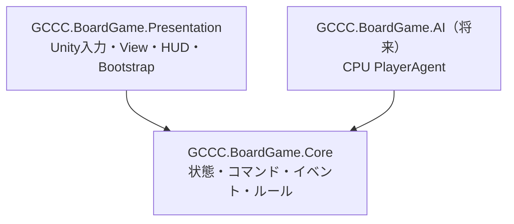
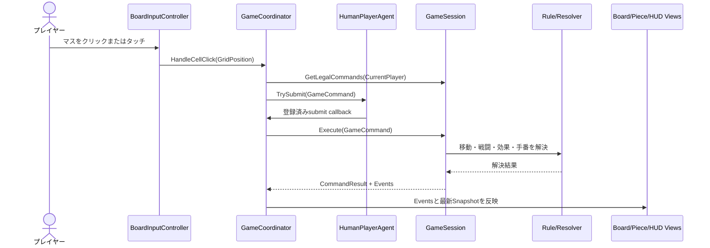

# アーキテクチャ

## 1. 設計方針

本プロジェクトは、ゲームルールをUnityから分離し、複数人が担当領域ごとに作業できる構成を採用しています。



`GCCC.BoardGame.Core.asmdef`は`noEngineReferences: true`で、`UnityEngine`、`MonoBehaviour`、`Vector2Int`、Input System、uGUIへ依存しません。Unity固有の処理はPresentationに置きます。

## 2. レイヤーの責務

| レイヤー | 主な責務 | 禁止事項 |
|---|---|---|
| Core Model | 盤面、セル、駒、プレイヤー、Snapshot | Unity型への依存 |
| Core Commands | プレイヤーからの操作要求 | Viewの直接操作 |
| Core Events | コマンド実行によって起きた事実 | Unity演出の指定 |
| Core Rules | 移動、戦闘、合体、特殊効果、手番 | InputやUIの参照 |
| `GameSession` | 状態所有、検証、コマンド実行、イベント生成 | Unityオブジェクトの保持 |
| Presentation Input | マウス・タッチを盤面座標へ変換 | ルール判定の再実装 |
| `GameCoordinator` | 選択状態、Agent、Command、Viewの仲介 | Core状態の直接変更 |
| Presentation Views | SnapshotとEventに従った表示 | 勝敗やダメージの独自計算 |
| Bootstrap | Config、Core、Prefab、Cameraの組み立て | ゲームルールの実装 |

## 3. Coreの状態モデル

### 座標、ID、プレイヤー、移動方向

| 型 | 役割 | 生成・使用例 |
|---|---|---|
| `GridPosition` | `Column`（x）と`Row`（y）で盤面座標を表す | `new GridPosition(2, 1)` |
| `PieceId` | コマを一意に識別する正の整数ID | `new PieceId(1)` |
| `PlayerId` | 所有者や手番を`Player1`／`Player2`で表す | `PlayerId.Player1` |
| `MoveDirections` | 移動可能な8方向をフラグで表す | `MoveDirections.North | MoveDirections.East` |

`GridPosition`はUnityの`Vector2Int`を使わないCore専用座標です。同じ列・行なら同じ座標として比較でき、`+`演算子で方向オフセットを加算できます。ただし、座標が盤内かどうかは`GridPosition`自身ではなく`GameSnapshot.IsInside`やRuleが判定します。

`PieceId`は数値が同じなら同じコマとして比較されます。0以下は指定できません。`PlayerId.Other()`は、`Player1`なら`Player2`、`Player2`なら`Player1`を返します。

`MoveDirections`で指定できる値は次のとおりです。相対座標は、現在位置から1マス移動したときの`Column`と`Row`の変化を表します。

| 値 | 方向 | 相対座標 |
|---|---|---|
| `MoveDirections.None` | 移動方向なし | なし |
| `MoveDirections.North` | 上 | `(0, +1)` |
| `MoveDirections.NorthEast` | 右上 | `(+1, +1)` |
| `MoveDirections.East` | 右 | `(+1, 0)` |
| `MoveDirections.SouthEast` | 右下 | `(+1, -1)` |
| `MoveDirections.South` | 下 | `(0, -1)` |
| `MoveDirections.SouthWest` | 左下 | `(-1, -1)` |
| `MoveDirections.West` | 左 | `(-1, 0)` |
| `MoveDirections.NorthWest` | 左上 | `(-1, +1)` |
| `MoveDirections.All` | 全8方向 | 上記8方向すべて |

複数方向はビットOR演算子`|`で組み合わせます。`MoveDirections`が許可するのは方向であり、現在の`DirectionalMovementRule`では指定方向へ1マスだけ移動できます。

### `PieceState`の生成例

盤面に存在するコマ1個につき、1個の`PieceState`インスタンスを作成します。コンストラクタの引数は次の順番です。

| 引数 | 型 | 意味 |
|---|---|---|
| `id` | `PieceId` | コマを一意に識別するID |
| `owner` | `PlayerId` | コマを所有するプレイヤー |
| `position` | `GridPosition` | 盤面上の現在位置 |
| `combatPower` | `int` | 現在の戦闘力。1以上を指定する |
| `moveDirections` | `MoveDirections` | コマが移動できる方向の組み合わせ |

たとえば、座標`(2, 1)`にいる「プレイヤー1が所有する、戦闘力2で上と右へ移動できるコマ」は次のように生成します。

```csharp
var piece = new PieceState(
    new PieceId(1),                    // コマ番号1
    PlayerId.Player1,                  // プレイヤー1のコマ
    new GridPosition(2, 1),            // 座標(2, 1)
    2,                                 // 戦闘力2
    MoveDirections.North |
    MoveDirections.East                // 上と右へ移動可能
);
```

`MoveDirections`はフラグ列挙型なので、複数の方向を`|`で組み合わせられます。全8方向へ移動できる場合は`MoveDirections.All`を指定します。

`PieceState`の変更は`WithPosition`、`WithCombatPower`、`WithAttributes`で新しいインスタンスを作成します。`GameSnapshot`も駒とセルをコピーするため、ViewやCPUが過去のSnapshotや進行中の状態を書き換えることはできません。

```csharp
PieceState movedPiece = piece.WithPosition(new GridPosition(2, 2));
PieceState damagedPiece = movedPiece.WithCombatPower(1);
```

この例でも元の`piece`と`movedPiece`は変更されません。戦闘力が0以下になったコマは、戦闘力0の`PieceState`として残すのではなく、`GameSession`の管理対象から削除されます。

### 盤面定義と実行時状態

| クラス | 役割 | 主な内容 |
|---|---|---|
| `CellDefinition` | 1マスの固定設定 | 座標、陣地所有者、特殊効果ID |
| `InitialPieceDefinition` | リセット時に生成する1個のコマの初期設定 | ID、所有者、初期位置、初期戦闘力、移動方向 |
| `GameDefinition` | ゲーム開始前の設計図 | 盤面サイズ、全セル、全初期駒、先手 |
| `GameSnapshot` | ある時点のゲーム状態を外部へ見せる読み取り専用コピー | 現在の全コマ、セル、手番、勝者、引き分け |

通常マスと、プレイヤー1の陣地マスは次のように定義できます。`territoryOwner`が`null`なら、どちらの陣地でもない通常マスです。`effectIds`は省略でき、指定した場合は配列の順番で特殊効果が処理されます。

```csharp
var normalCell = new CellDefinition(
    new GridPosition(2, 5));

var player1TerritoryCell = new CellDefinition(
    new GridPosition(2, 0),
    PlayerId.Player1,
    new[] { "power-up" });
```

`InitialPieceDefinition`は、現在盤上にいるコマではなく「開始時やリセット時に、どのコマを作るか」という設定です。引数の意味と順番は`PieceState`と同じです。

```csharp
var initialPiece = new InitialPieceDefinition(
    new PieceId(1),
    PlayerId.Player1,
    new GridPosition(0, 1),
    1,
    MoveDirections.All);

PieceState initialState = initialPiece.CreateState();
```

`GameDefinition.CreateStandard()`を使うと、6×10盤面、12個の初期駒、プレイヤー1先手という標準定義をまとめて作れます。

```csharp
GameDefinition definition = GameDefinition.CreateStandard();
```

`GameSnapshot`は`GameSession.Snapshot`から取得します。コンストラクタはCore内部専用なので、Presentationや将来のCPUが直接生成することはありません。

```csharp
GameSnapshot snapshot = session.Snapshot;

bool isInside = snapshot.IsInside(new GridPosition(2, 1));
bool found = snapshot.TryGetPiece(new PieceId(1), out PieceState currentPiece);
int player1PieceCount = snapshot.GetPieceCount(PlayerId.Player1);
bool isGameOver = snapshot.IsGameOver;
```

4クラスの関係は次のように整理できます。

```text
GameDefinition（ゲーム全体の設計図）
├─ CellDefinition（各マスの固定設定）
└─ InitialPieceDefinition（各コマの初期設定）
           ↓ GameSessionの開始・Reset
       PieceState（各コマの現在状態）
           ↓ Snapshot取得
       GameSnapshot（盤面全体の読み取り専用コピー）
```

### `GameSession`

`GameSession`は実行時状態を所有する唯一のクラスです。

コンストラクタではゲーム定義と、必要に応じて差し替えるRuleを受け取ります。

| 引数 | 型 | 省略時 |
|---|---|---|
| `definition` | `GameDefinition` | 省略不可 |
| `movementRule` | `IMovementRule` | `DirectionalMovementRule` |
| `combatResolver` | `ICombatResolver` | `SimultaneousCombatResolver` |
| `fusionResolver` | `IFusionResolver` | `DisabledFusionResolver` |
| `cellEffectHandlers` | `IEnumerable<ICellEffectHandler>` | 効果なし |

```csharp
GameSnapshot Snapshot { get; }
CommandResult Execute(GameCommand command);
IReadOnlyList<GameCommand> GetLegalCommands(PlayerId player);
void Reset();
```

内部では駒をIDと座標の両方で検索できるDictionaryに保持し、セル定義、現在手番、勝者、引き分け状態を管理します。外部コードはDictionaryへアクセスできません。

標準ルールでゲームを開始し、移動Commandを実行する最小例は次のとおりです。

```csharp
var session = new GameSession(GameDefinition.CreateStandard());

var command = new MovePieceCommand(
    PlayerId.Player1,
    new PieceId(1),
    new GridPosition(0, 2));

CommandResult result = session.Execute(command);
GameSnapshot latestSnapshot = session.Snapshot;
```

`GetLegalCommands`は現在の手番プレイヤーが実行できるCommandを返します。`Execute`はCommandを検証して状態を更新し、結果を`CommandResult`として返します。`Reset`は`InitialPieceDefinition`から全コマを作り直し、手番と勝敗も初期状態へ戻します。

## 4. CommandとResult

### Command

Commandは「状態をこの値に変える」というデータではなく、プレイヤーが`GameSession`へ送る操作要求です。

| Command | コンストラクタ引数 | 意味 |
|---|---|---|
| `MovePieceCommand` | `player`, `pieceId`, `destination` | 指定した自分のコマを目的地へ動かす要求 |
| `FusePiecesCommand` | `player`, `firstPieceId`, `secondPieceId` | 指定した2個のコマを合体する要求。標準ルールでは無効 |

```csharp
var move = new MovePieceCommand(
    PlayerId.Player1,
    new PieceId(1),
    new GridPosition(0, 2));

var fusion = new FusePiecesCommand(
    PlayerId.Player1,
    new PieceId(1),
    new PieceId(3));
```

すべてのCommandは`Player`を持ち、`GameSession.Execute`で次の順に検証されます。

1. Commandがnullではない。
2. ゲームが終了していない。
3. Commandのプレイヤーが現在手番と一致する。
4. 対応するCommand Handlerが存在する。
5. 対象駒の存在、所有権、個別ルールが正しい。

### `CommandResult`

成功時は`Success=true`と発生した`GameEvent`の一覧を返します。失敗時は状態を変更せず、次の`CommandFailureReason`を返します。

- `GameOver`
- `NotPlayersTurn`
- `PieceNotFound`
- `NotPieceOwner`
- `IllegalMove`
- `FusionDisabled`
- `InvalidCommand`

呼び出し側は次のように成功・失敗を確認します。Presentationは成功時の`Events`と最新の`Snapshot`を使って表示を更新します。

```csharp
CommandResult result = session.Execute(move);

if (result.Success)
{
    IReadOnlyList<GameEvent> events = result.Events;
}
else
{
    CommandFailureReason reason = result.FailureReason;
}
```

## 5. Event

Eventは「何をしてほしいか」ではなく、Command実行によって「何が起きたか」を表します。

| Event | 主な値 | 意味 |
|---|---|---|
| `PieceMoved` | `PieceId`, `From`, `To` | コマが移動元から移動先へ進んだ |
| `CombatResolved` | 攻撃・防御のID、戦闘前後の戦闘力 | 戦闘力計算が完了した |
| `PiecePowerChanged` | `PieceId`, `PreviousPower`, `CurrentPower` | 生存コマの戦闘力が変わった |
| `PieceDestroyed` | `PieceId`, `Position` | コマが盤面から消滅した |
| `PiecesFused` | 合体元2個と合体後の`PieceId` | 2個のコマが新しいコマへ合体した |
| `CellEffectTriggered` | `EffectId`, `PieceId`, `Position` | セル効果が発動した |
| `TurnChanged` | 交代前後の`PlayerId`, `TurnWasPassed` | 手番が交代、または自動パスされた |
| `GameEnded` | `Winner`, `IsDraw` | 勝者または引き分けが確定した |

PresentationはこのEventと実行後Snapshotを使用します。たとえば、駒が消えるかどうかをView側で戦闘力から再計算してはいけません。

## 6. コマンド実行のデータフロー



`HumanPlayerAgent.BeginTurn`は最新Snapshot、合法Command一覧、送信用callbackを受け取ります。将来のCPUも同じ`IPlayerAgent`契約を利用します。

## 7. RuleとPlayerAgentの差し替え口

Ruleは状態を直接所有せず、`GameSession`から渡された入力を計算して結果を返します。

| 型 | 主な入力 | 戻り値・役割 |
|---|---|---|
| `IMovementRule` | `GameSnapshot`, `PieceState` | そのコマの合法な移動先一覧 |
| `ICombatResolver` | 攻撃側と防御側の`PieceState` | 双方の残り戦闘力を持つ`CombatResolution` |
| `IFusionResolver` | `GameSnapshot`または2個の`PieceState` | 合法ペアと、合体後のコマを持つ`FusionResolution` |
| `ICellEffectHandler` | Snapshot、コマ、セルを持つ`CellEffectContext` | 効果適用後のコマとEventを持つ`CellEffectResult` |
| `TurnResolver` | 行動した`PlayerId`と、各プレイヤーに合法手があるかを返す関数 | 次の手番、自動パス、引き分けを持つ`TurnResolution` |

標準実装は`DirectionalMovementRule`、`SimultaneousCombatResolver`、`DisabledFusionResolver`です。これらは`GameSession`のコンストラクターへ注入できます。

`IPlayerAgent`は、人間と将来のCPUに共通する「誰がCommandを選ぶか」の契約です。

| メンバー | 役割 |
|---|---|
| `Player` | Agentが担当するプレイヤー |
| `BeginTurn` | 最新Snapshot、合法Command、Command送信用callbackを受け取る |
| `EndTurn` | 手番終了時に送信用callbackなどを破棄する |

現在の`HumanPlayerAgent`は入力で選ばれたCommandを`TrySubmit`から送信します。CPUを追加する場合も`IPlayerAgent`を実装し、`BeginTurn`で渡されたSnapshotと合法Commandから1つを選びます。

## 8. Presentationの構成

### SceneとBootstrap

`SampleScene`のルートはMain Cameraと`Board Game Bootstrap`だけです。`BoardGameBootstrap`は次を組み立てます。

1. `BoardGameConfig`から`GameDefinition`を生成する。
2. `GameSession`と`RuntimeSpriteFactory`を作る。
3. Cameraを盤面全体が収まる正投影に設定する。
4. Board、Piece、HUDのPrefabを生成する。
5. `GameCoordinator`と`BoardInputController`を接続する。

Prefab参照が未設定の場合は、同じComponentを持つGameObjectを実行時に生成するフォールバックがあります。

### View

| クラス | 表示上の責務 | 保持・判断しないもの |
|---|---|---|
| `BoardView` | 60セル、陣地枠、ラベル、選択、移動候補、座標変換 | コマの戦闘力や勝敗ルール |
| `PieceViewManager` | `PieceView`の生成、Eventに従った更新・削除、リセット時の再構築 | 戦闘結果の再計算 |
| `PieceView` | 1個のコマの所有者色、位置、戦闘力テキスト | Coreの`PieceState`の直接変更 |
| `GameHudView` | 手番・勝敗テキスト、リセットボタン、UI入力判定 | 手番や勝者の決定 |
| `RuntimeSpriteFactory` | セルと円形コマのSpriteを実行時生成 | ゲーム状態 |

`PieceState`と`PieceView`は1対1で対応しますが、役割は異なります。`PieceState`はCore上の正しいゲーム状態、`PieceView`はUnity上の見た目です。各コマGameObjectへ戦闘ルールを持たせず、`PieceViewManager`がSnapshotとEventを使って見た目だけを同期します。

## 9. 設定とAsset

`StandardBoardGameConfig.asset`は`BoardGameConfig`の標準設定です。列数、行数、先手、両陣地行、両初期配置行、初期戦闘力、初期移動方向、セル効果IDを保持します。

盤面、駒、HUDは個別Prefabです。これにより、UI担当と盤面担当が同じScene YAMLを同時に編集する可能性を減らします。

## 10. 共有変更になりやすい箇所

ルール実装は分割されていますが、`GameSession`はコマンド実行順と状態更新を統括する共有箇所です。新しいCommand、勝敗条件、複数Ruleをまたぐ処理を追加する場合は、先にCore契約のPRを作り、担当者間で確定してから並行作業へ進みます。
