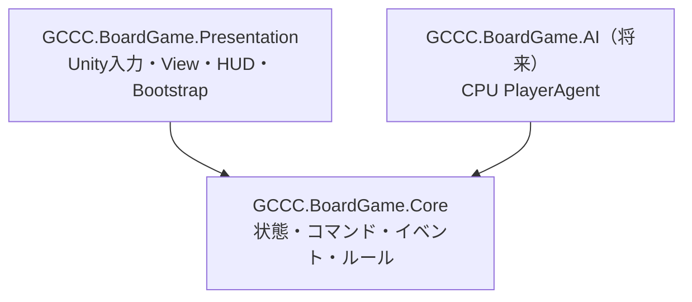
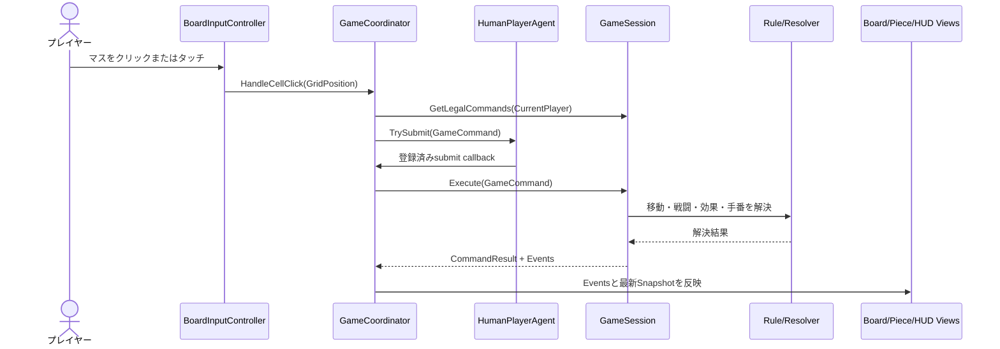

# アーキテクチャ

## 1. 設計方針

本プロジェクトは、ゲームルールをUnityから分離し、複数人が担当領域ごとに作業できる構成を採用しています。



`GCCC.BoardGame.Core.asmdef`は`noEngineReferences: true`で、`UnityEngine`、`MonoBehaviour`、`Vector2Int`、Input System、uGUIへ依存しません。Unity固有の処理はPresentationに置きます。

## 2. レイヤーの責務

| レイヤー | 主な責務 | 禁止事項 |
|---|---|---|
| Core Model | 盤面、セル、駒、プレイヤー、Snapshot | Unity型への依存 |
| Core Commands | プレイヤーからの操作要求 | Viewの直接操作 |
| Core Events | コマンド実行によって起きた事実 | Unity演出の指定 |
| Core Rules | 移動、戦闘、合体、特殊効果、手番 | InputやUIの参照 |
| `GameSession` | 状態所有、検証、コマンド実行、イベント生成 | Unityオブジェクトの保持 |
| Presentation Input | マウス・タッチを盤面座標へ変換 | ルール判定の再実装 |
| `GameCoordinator` | 選択状態、Agent、Command、Viewの仲介 | Core状態の直接変更 |
| Presentation Views | SnapshotとEventに従った表示 | 勝敗やダメージの独自計算 |
| Bootstrap | Config、Core、Prefab、Cameraの組み立て | ゲームルールの実装 |

## 3. Coreの状態モデル

### 主な値とモデル

- `GridPosition`: `Column`と`Row`を持つUnity非依存の座標値。
- `PieceId`: 駒を一意に識別する値オブジェクト。
- `PlayerId`: `Player1`または`Player2`。
- `MoveDirections`: 8方向を表すフラグ列挙型。
- `PieceState`: ID、所有者、位置、戦闘力、移動方向を持つ不変オブジェクト。
- `CellDefinition`: 位置、陣地所有者、特殊効果IDの順序付き一覧。
- `InitialPieceDefinition`: リセット時に生成する駒の定義。
- `GameDefinition`: 盤面サイズ、全セル、初期駒、先手。
- `GameSnapshot`: 外部へ公開する読み取り専用の状態コピー。

`PieceState`の変更は`WithPosition`、`WithCombatPower`、`WithAttributes`で新しいインスタンスを作成します。`GameSnapshot`も駒とセルをコピーするため、ViewやCPUが過去のSnapshotや進行中の状態を書き換えることはできません。

### `GameSession`

`GameSession`は実行時状態を所有する唯一のクラスです。

```csharp
GameSnapshot Snapshot { get; }
CommandResult Execute(GameCommand command);
IReadOnlyList<GameCommand> GetLegalCommands(PlayerId player);
void Reset();
```

内部では駒をIDと座標の両方で検索できるDictionaryに保持し、セル定義、現在手番、勝者、引き分け状態を管理します。外部コードはDictionaryへアクセスできません。

## 4. CommandとResult

### Command

- `MovePieceCommand`: プレイヤー、駒ID、移動先を指定します。
- `FusePiecesCommand`: プレイヤーと2個の駒IDを指定します。標準ルールでは無効です。

すべてのCommandは`Player`を持ち、`GameSession.Execute`で次の順に検証されます。

1. Commandがnullではない。
2. ゲームが終了していない。
3. Commandのプレイヤーが現在手番と一致する。
4. 対応するCommand Handlerが存在する。
5. 対象駒の存在、所有権、個別ルールが正しい。

### `CommandResult`

成功時は`Success=true`と発生した`GameEvent`の一覧を返します。失敗時は状態を変更せず、次の`CommandFailureReason`を返します。

- `GameOver`
- `NotPlayersTurn`
- `PieceNotFound`
- `NotPieceOwner`
- `IllegalMove`
- `FusionDisabled`
- `InvalidCommand`

## 5. Event

| Event | 意味 |
|---|---|
| `PieceMoved` | 駒が移動元から移動先へ進んだ |
| `CombatResolved` | 攻撃・防御の戦闘力計算が完了した |
| `PiecePowerChanged` | 生存駒の戦闘力が変わった |
| `PieceDestroyed` | 駒が盤面から消滅した |
| `PiecesFused` | 2個の駒が新しい駒へ合体した |
| `CellEffectTriggered` | セル効果が順序どおりに発動した |
| `TurnChanged` | 手番が交代、または自動パスされた |
| `GameEnded` | 勝者または引き分けが確定した |

PresentationはこのEventと実行後Snapshotを使用します。たとえば、駒が消えるかどうかをView側で戦闘力から再計算してはいけません。

## 6. コマンド実行のデータフロー



`HumanPlayerAgent.BeginTurn`は最新Snapshot、合法Command一覧、送信用callbackを受け取ります。将来のCPUも同じ`IPlayerAgent`契約を利用します。

## 7. Ruleの差し替え口

- `IMovementRule`: 駒ごとの合法な移動先を返します。
- `ICombatResolver`: 攻撃側と防御側の戦闘後戦闘力を返します。
- `IFusionResolver`: 合体の有効状態、合法ペア、合体後の駒を返します。
- `ICellEffectHandler`: 効果IDごとに移動後の駒を更新します。
- `TurnResolver`: 行動後の交代、自動パス、引き分けを解決します。

標準実装は`DirectionalMovementRule`、`SimultaneousCombatResolver`、`DisabledFusionResolver`です。これらは`GameSession`のコンストラクターへ注入できます。

## 8. Presentationの構成

### SceneとBootstrap

`SampleScene`のルートはMain Cameraと`Board Game Bootstrap`だけです。`BoardGameBootstrap`は次を組み立てます。

1. `BoardGameConfig`から`GameDefinition`を生成する。
2. `GameSession`と`RuntimeSpriteFactory`を作る。
3. Cameraを盤面全体が収まる正投影に設定する。
4. Board、Piece、HUDのPrefabを生成する。
5. `GameCoordinator`と`BoardInputController`を接続する。

Prefab参照が未設定の場合は、同じComponentを持つGameObjectを実行時に生成するフォールバックがあります。

### View

- `BoardView`: 60セル、陣地枠、ラベル、選択、移動候補、スクリーン座標変換。
- `PieceViewManager`: 駒Viewの生成、Eventに従った更新・削除、リセット時の再構築。
- `PieceView`: 所有者色、位置、戦闘力テキスト。
- `GameHudView`: Screen Space Canvas、手番・勝敗テキスト、リセットボタン、UI入力判定。
- `RuntimeSpriteFactory`: 画像Assetを追加せず、セルと円形駒のSpriteを実行時生成。

## 9. 設定とAsset

`StandardBoardGameConfig.asset`は`BoardGameConfig`の標準設定です。列数、行数、先手、両陣地行、両初期配置行、初期戦闘力、初期移動方向、セル効果IDを保持します。

盤面、駒、HUDは個別Prefabです。これにより、UI担当と盤面担当が同じScene YAMLを同時に編集する可能性を減らします。

## 10. 共有変更になりやすい箇所

ルール実装は分割されていますが、`GameSession`はコマンド実行順と状態更新を統括する共有箇所です。新しいCommand、勝敗条件、複数Ruleをまたぐ処理を追加する場合は、先にCore契約のPRを作り、担当者間で確定してから並行作業へ進みます。
