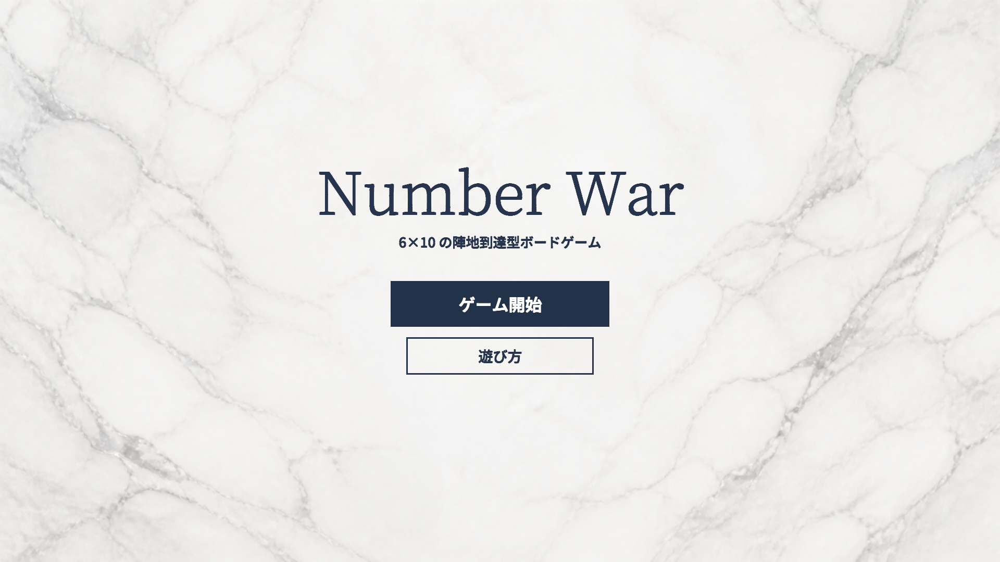
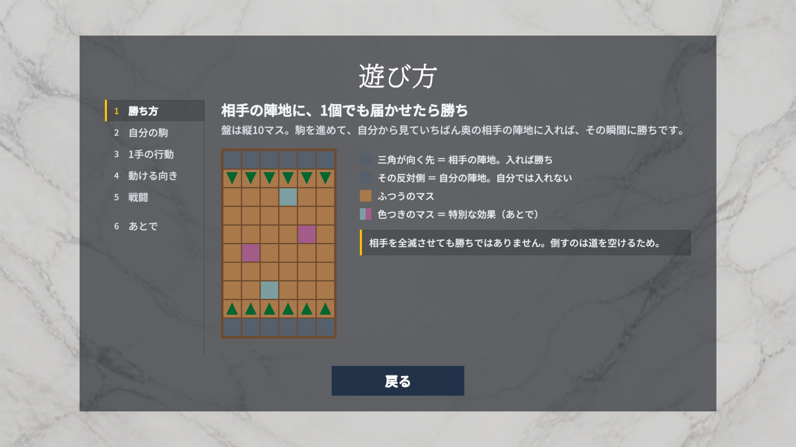
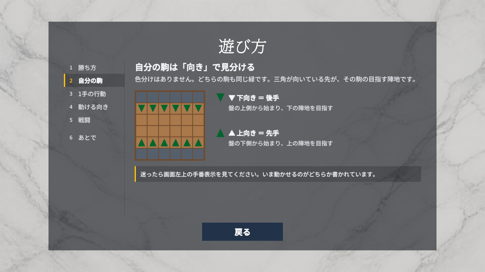
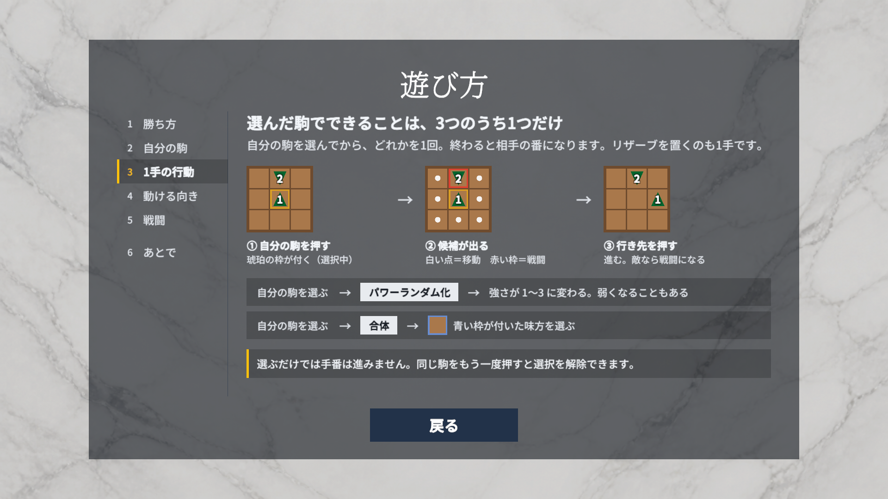
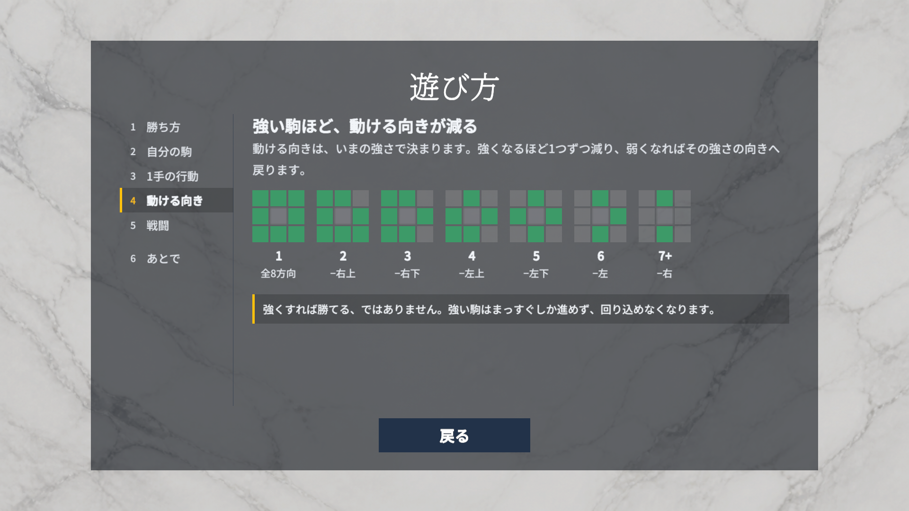
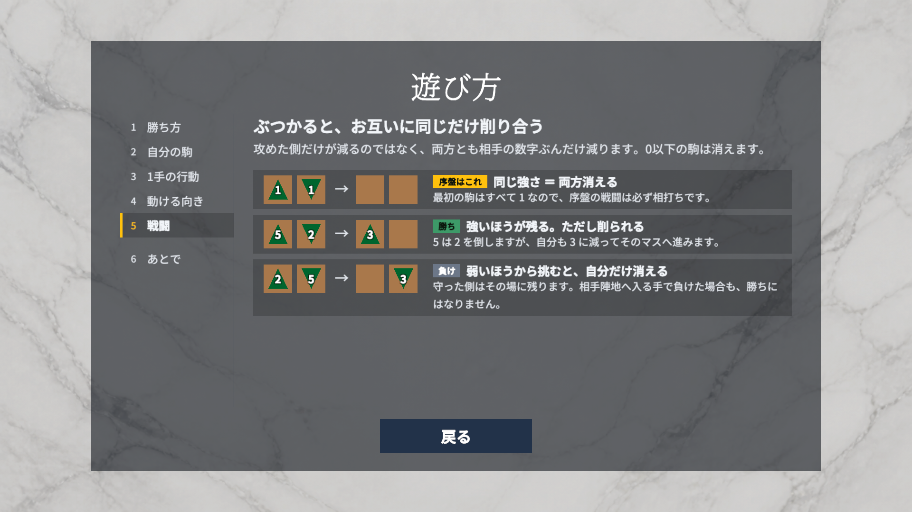
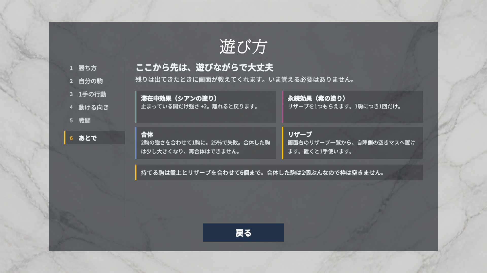
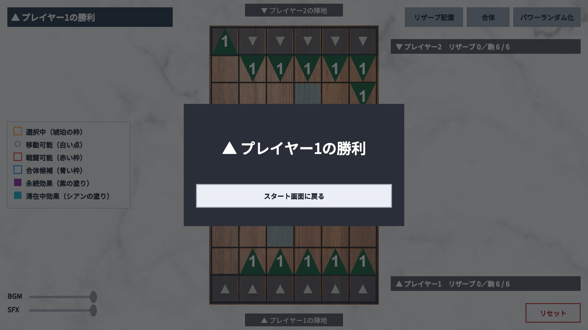

# 画面・操作ガイド

「Number War」の実画面と操作の入口をまとめます。詳しい数値・条件は[ゲームルール](GAME_RULES.md)、起動方法は[開発ガイド](DEVELOPMENT.md)を参照してください。

掲載画像は2026-09-02（JST）、コミット`51a126949416a63aa1760bcc2ffeacd7cb63a206`のゲームをUnity `6000.3.11f1`で再生して撮影したものです。すべて1920×1080の実際のGame Viewで、UIや文言の画像補正はしていません。[画面文言の注意点](#5-現行画面の注意点)も併せて確認してください。

## 1. タイトル



- **ゲーム開始**：初期状態のゲームを開始します。
- **遊び方**：同じScene内の説明ページを開きます。

```text
タイトル ── 遊び方 ── 説明6節（左ナビで切り替え）
   ↑                         │
   └──────── 戻る ──────────┘
   │
   └─ ゲーム開始 → ゲーム → リザルト → スタート画面に戻る
                                              │
                    タイトル ←────────────────┘
```

タイトルと説明は`TitleScene`、ゲームとリザルトは`SampleScene`です。リザルトはゲーム画面に重なるパネルで、別Sceneではありません。

## 2. 遊び方

左の見出しを押して節を切り替えます。「戻る」はタイトルへ戻る操作です。説明を開き直すと、毎回「勝ち方」から始まります。

### 1 勝ち方



1個でも生き残って相手の陣地へ到達すれば勝ちです。この図の「上＝相手、下＝自分」は先手▲の視点です。後手▼は下の陣地を目指します。

### 2 自分の駒



色は両者とも緑。▲が先手、▼が後手です。ゲーム左上の手番表示と三角の向きを合わせて確認します。

### 3 1手の行動



自駒を押す → 候補を見る → 行き先を押す。白い点は空きマスへの移動、赤い枠は敵との戦闘です。選ぶだけでは手番は進みません。リザーブ配置は別の行動として第6節に登場します。

### 4 動ける向き



図の数字は現在の実効戦闘力です。方向はその時点の数字から決まり、過去の最大値からは決まりません。画面の「永久に減る」という文言には[注意点](#5-現行画面の注意点)があります。

### 5 戦闘



双方が相手の数字ぶんのダメージを同時に受けます。0以下の駒は消え、生き残った駒は残りの数字で続けます。

### 6 あとで



シアンは滞在中効果、紫は駒ごとに一度の効果です。リザーブは右側の一覧から選び、白い点の空きマスへ置きます。上限や合体制限の詳細は[ゲームルール §8](GAME_RULES.md#8-パワーランダム化合体特殊マス)を参照してください。

## 3. ゲーム画面


| 場所 | 見るもの・操作 |
|---|---|
| 左上 | 現在の手番と▲▼ |
| 中央 | 盤面。数字は一時効果を含む現在の戦闘力。合体した駒はひと回り大きく、数字が白縁の黒字 |
| 左中央 | 凡例7行。選択中・移動可能・戦闘可能・合体候補・合体した駒は常時、特殊マスの2行は盤に特殊マスがある設定でのみ表示 |
| 右上 | リザーブ配置、合体、パワーランダム化 |
| 右側 | 上が▼、下が▲のリザーブ一覧。`駒 n / 6`は盤上とリザーブが占める枠数。合体した駒は2枠を使う |
| 左下 | BGM／SFX音量 |
| 右下 | リセット。選択やリザーブも含めてゲームを初期状態へ戻す |

### 基本操作

左クリック、またはプライマリタッチで押します。マウスを乗せたときとキーボードで選んだときは、ボタンに薄い塗りが出ます。

uGUIの既定の`ColorTint`は`targetGraphic`の色に乗算するため、枠線だけのボタン（「遊び方」「リセット」、遊び方ページのナビ）では何も変化しませんでした。`ButtonFocusHighlight`が専用の重ね絵をフェードさせることで、塗りの有無によらず同じ反応を出します。

| やりたいこと | 操作 |
|---|---|
| 移動・戦闘 | 自駒 → 白い点・赤い枠の行き先 |
| 選択解除・変更 | 同じ自駒をもう一度押す／別の自駒を押す |
| パワーランダム化 | 自駒 → 「パワーランダム化」 |
| 合体 | 未合体の自駒 → 「合体」 → 青い枠の味方 |
| リザーブ配置 | 自分のリザーブカード → 白い点の配置先 |

「リザーブ配置」ボタンでも配置可能な先頭のリザーブを選べます。配置モード中に同じボタン・同じカードを押すと解除できます。使えない操作や手番ではない側のカードは無効です。合法な移動・戦闘・ランダム化・合体試行・配置のいずれかを行うと1手を使います。

色と形の詳細は[ゲームルール §9](GAME_RULES.md#9-表示)にまとめています。特殊マスの上に白い点や枠が重なることもあります。

## 4. リザルト



勝敗が決まると盤面に結果パネルが重なり、背景の盤面・操作ボタン・リザーブ・音量UIは操作できなくなります。「スタート画面に戻る」でタイトルへ戻り、次の「ゲーム開始」は新しいゲームになります。

## 5. 現行画面の注意点

以下は、遊び方ページの説明文を読んだときに誤解しやすい箇所です。

この節にあった「動ける向きは永久に減る」「上＝相手・下＝自分」「3つのうち1つだけ」「再合体の可否」は、ページ側の文言を実装に合わせて修正し、画像も撮り直しました。

| 画面の表現 | 現行実装では |
|---|---|
| 第5節「序盤の戦闘は必ず相打ち」 | 初期値1同士なら相打ち。序盤でもランダム化・合体・特殊マスで数字が変われば結果は異なる |
| 第6節「リザーブを1つもらえる」 | 占有枠が上限6に達している場合は獲得しない。現行実装はその場合も効果適用履歴を残すため、後から同じ駒で踏み直しても獲得できない |

ルールの確認元は[`ProfileMoveDirectionResolver`](../Assets/Scripts/BoardGame/Core/Rules/Movement/ProfileMoveDirectionResolver.cs)、[`AdjacentFusionResolver`](../Assets/Scripts/BoardGame/Core/Rules/Fusion/AdjacentFusionResolver.cs)、[`CellEffectProcessor`](../Assets/Scripts/BoardGame/Core/Internal/CellEffectProcessor.cs)、[`GameSession`](../Assets/Scripts/BoardGame/Core/GameSession.cs)です。画面文言は[`HowToPlayContent`](../Assets/Scripts/BoardGame/Presentation/Views/HowToPlayContent.cs)にあります。

## 6. 確認記録と更新方法

### 2026-09-02の確認範囲

公式Unity CLI／Pipelineから、再生中のUIボタンのイベントと`GameCoordinator`の操作入口を呼び、実行後の状態とGame Viewを照合しました。盤面を直接書き換えず、移動・戦闘・勝利は通常の合法手で進めています。物理マウス・タッチイベントを注入した実機入力テストとは異なります。

| 対象 | 結果 |
|---|---|
| タイトルと遊び方6節 | 全節の表示・切り替えを確認、画像を目視確認 |
| 遊び方の再表示 | 第6節から閉じて開き直すと第1節へ復帰 |
| ゲーム開始・駒選択 | 60マス・12駒・先手、選択と同じ駒による解除、移動候補を確認 |
| 移動・特殊マス | 手番交代、シアン進入で1→3、退出で3→1を確認 |
| パワーランダム化・合体 | ボタンから実行して手番交代。合体成功で盤上12→11駒を確認 |
| 戦闘・リザーブ | 相打ちで12→10駒、紫マスでリザーブ獲得、配置候補と配置後のカード削除・駒生成を確認 |
| リセット | 初期配置に戻し、別の操作シナリオを開始できることを確認 |
| 勝利・復帰 | 陣地到達で勝利パネル、盤面入力停止、背景ボタン無効化、タイトル復帰を確認 |
| Console | ゲームの実行エラーなし。Pipelineの非automated起動に関する警告あり |

今回Unity Test Runnerは再実行していません。確率の全結果、引き分け、音量の聴感、タッチ実機、全解像度、Standaloneビルドは今回の実画面確認には含めていません。既存テストと追加確認の方針は[テストガイド](TESTING.md)を参照してください。

### 次回の更新

1. 確認対象コミット・Unityバージョン・撮影日を記録し、Sceneの未保存変更がないことを確認する。
2. タイトル、説明6節、選択中のゲーム、リザルトを16:9のGame Viewで撮影する。HUDを含む画面合成後の画像を使う。
3. この文書の対応画像を差し替え、文言・色・配置・状態遷移を照合する。READMEは同じ`game-view.png`を参照する。
4. 古い比較用の`screen-design-*-before.png`／`after.png`は履歴資料として残し、現在の画面と混同しない。
5. 実装と説明文の差を再確認し、この節の確認範囲と[注意点](#5-現行画面の注意点)を更新する。
